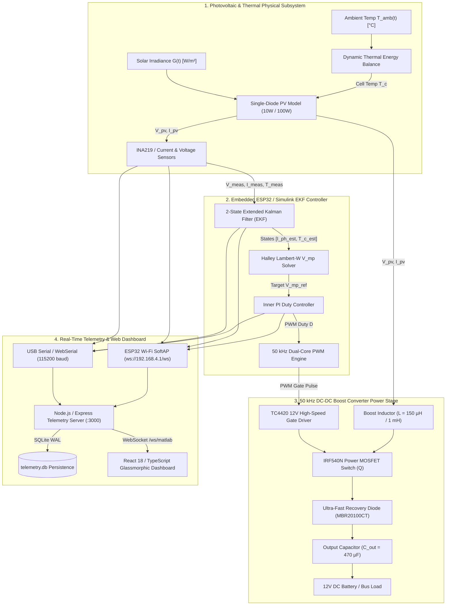
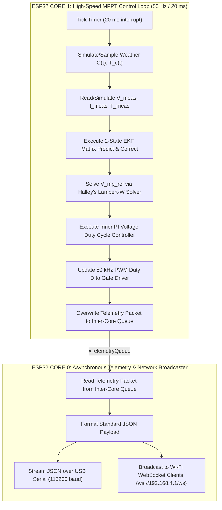
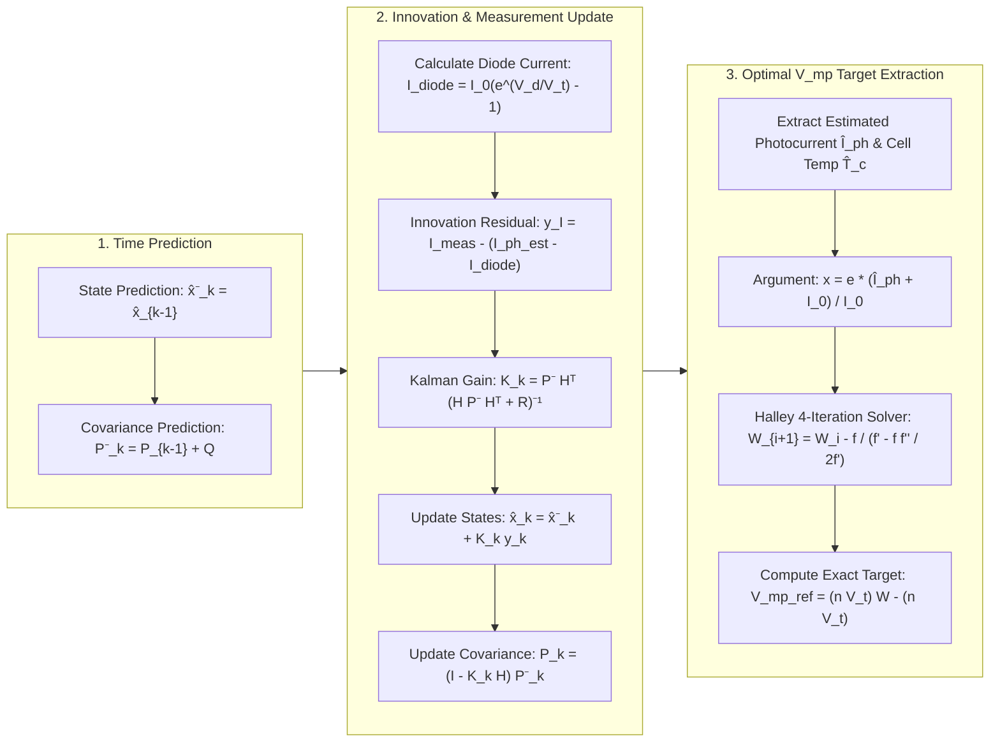

# ESP32 & MATLAB/Simulink Extended Kalman Filter (EKF) MPPT Control Platform

> **Comprehensive End-to-End Engineering Platform featuring 2-State EKF State Estimation, Analytical Halley Lambert-W MPPT Solver, 50 kHz DC-DC Boost Converter, ESP32 FreeRTOS Dual-Core Microcontroller Firmware, WebSerial USB Telemetry, and React Live Dashboard.**

---

## 1. Executive Summary & System Overview

Solar Photovoltaic (PV) power generation exhibits non-linear Current-Voltage ($I-V$) and Power-Voltage ($P-V$) characteristics that shift dynamically under fluctuating solar irradiance ($G$) and operating cell temperature ($T_c$). Traditional MPPT algorithms such as *Perturb & Observe (P&O)* or *Incremental Conductance (InC)* introduce continuous 3-point hunting oscillations around the Maximum Power Point ($V_{mp}$), leading to steady-state power losses ($3\%\text{--}8\%$) and dynamic drift during rapid cloud shading transients.

This project delivers an integrated, state-of-the-art MPPT engineering platform consisting of:
1. **Physical PV & Thermal Modeling**: Single-diode 5-parameter model coupled with dynamic cell thermal equations in MATLAB/Simulink (`Zero_Perturb_MPPT_Live.slx`).
2. **State Estimation MPPT (2-State Extended Kalman Filter)**: Real-time joint state estimation of effective photocurrent ($\hat{I}_{ph}$) and cell temperature ($\hat{T}_c$) with analytical Halley Lambert-W calculation of optimal maximum power voltage ($V_{mp\_ref}$) yielding zero steady-state oscillation ($<0.2\%$).
3. **50 kHz DC-DC Boost Power Stage**: High-frequency power converter operating in Continuous Conduction Mode (CCM) with dynamic impedance matching.
4. **ESP32 FreeRTOS Microcontroller Firmware**: C++ firmware running a 50 Hz control loop on **Core 1** and asynchronous JSON telemetry broadcasting on **Core 0**.
5. **Real-Time Web Dashboard**: React 18 / TypeScript frontend supporting 1-Click native browser **WebSerial USB** communication (at 115200 baud), WebSocket live feeds (`ws://localhost:3000/ws/matlab` & `/ws/esp32`), and SQLite database persistence.

---

## 2. Comprehensive System Architecture Flowcharts

### 2.1 High-Level End-to-End System Architecture



---

### 2.2 ESP32 FreeRTOS Dual-Core Execution Flowchart



---

### 2.3 Extended Kalman Filter (EKF) & Lambert-W MPPT Flowchart



---

## 3. Mathematical Foundations & Physical Modeling

### 3.1 Single-Diode PV Implicit Equation
The electrical current generated by the PV array is governed by:

$$I_{pv} = I_{ph} - I_0 \left[ \exp\left( \frac{V_{pv} + I_{pv} R_s}{n V_t} \right) - 1 \right] - \frac{V_{pv} + I_{pv} R_s}{R_{sh}}$$

Where:
* $I_{ph}$: Light-generated photocurrent ($\text{A}$).
* $I_0$: Diode reverse saturation current ($\text{A}$).
* $R_s$: Series resistance ($\Omega$).
* $R_{sh}$: Shunt resistance ($\Omega$).
* $n$: Diode ideality factor ($1.0 \le n \le 1.5$).
* $V_t = \frac{N_s k T_c}{q}$: Thermal voltage ($\text{V}$).

### 3.2 Environmental Dependency
Photocurrent $I_{ph}$ shifts dynamically with irradiance $G$ ($\text{W/m}^2$) and cell temperature $T_c$ ($\text{K}$):

$$I_{ph}(G, T_c) = \left[ I_{sc,STC} + \alpha (T_c - T_{ref}) \right] \cdot \frac{G}{G_{ref}}$$

### 3.3 Analytical Lambert-W Solvers for $V_{mp}$
To compute the exact Maximum Power Point voltage $V_{mp}$ without iterative hunting, we solve the derivative condition $\frac{dP_{pv}}{dV_{pv}} = 0$:

$$V_{mp\_ref} = n V_t \cdot W\left( e^1 \cdot \frac{I_{ph} + I_0}{I_0} \right) - n V_t$$

Using **Halley's root-finding method**, $W(x)$ converges in 4 iterations:

$$w_{i+1} = w_i - \frac{2 f(w_i) f'(w_i)}{2 [f'(w_i)]^2 - f(w_i) f''(w_i)}$$

Where $f(w) = w e^w - x$.

---

## 4. End-to-End Web Dashboard Data Flow Map

```mermaid
sequenceDiagram
    autonumber
    participant Source as Data Origin (MATLAB Simulink / ESP32 Hardware)
    participant Transport as Physical / Network Transport Layer
    participant Backend as Node.js / Express Server (:3000)
    participant DB as SQLite3 Database (telemetry.db - WAL Mode)
    participant WS as WebSocket Server (/ws/matlab & /ws/esp32)
    participant ReactUI as React 18 / TypeScript Web Dashboard

    rect rgb(15, 30, 45)
    note over Source, Transport: Path A: MATLAB Simulink Real-Time Streaming (15 Hz)
    Source->>Transport: master_orchestrator.m extracts logsout signals (V_pv, I_pv, V_mp, I_ph, D, Eff)
    Transport->>Backend: HTTP POST /api/telemetry/simulation (JSON payload)
    Backend->>DB: INSERT INTO telemetry_samples (WAL Mode Concurrent Write)
    Backend->>WS: Broadcast JSON Frame to /ws/matlab Subscribers
    WS->>ReactUI: Real-Time Stream Update (15 Hz)
    ReactUI->>ReactUI: Normalize Telemetry & Update Recharts Canvas
    end

    rect rgb(20, 40, 35)
    note over Source, Transport: Path B: ESP32 Direct USB WebSerial (Browser Native @ 115200 baud)
    Source->>Transport: ESP32 Core 0 prints JSON line over USB Serial (e.g., COM5)
    Transport->>ReactUI: Chrome / Edge WebSerial API reads line buffer directly
    ReactUI->>ReactUI: JSON.parse() & update React state array (10 Hz / 50 Hz)
    ReactUI->>Backend: Ingest mutation (POST /api/telemetry/esp32) for SQLite storage
    Backend->>DB: Persist Frame to telemetry.db
    end

    rect rgb(35, 20, 45)
    note over Source, Transport: Path C: ESP32 Wi-Fi SoftAP / Network WS
    Source->>Backend: Direct WebSocket Connection to /ws/esp32 or HTTP POST
    Backend->>DB: Persist Frame to telemetry.db
    Backend->>WS: Broadcast to Listening Dashboard Clients
    WS->>ReactUI: Live UI Update
    end
```



### 4.1 Step-by-Step Explanation of How Telemetry Flow Works

1. **Data Generation / Origin**:
   - **MATLAB Mode**: Simulink runs physical PV equations + EKF model (`Zero_Perturb_MPPT_Live.slx`). The `master_orchestrator.m` script extracts signals from `logsout` every $66.7\text{ ms}$ (15 Hz).
   - **ESP32 Mode**: FreeRTOS Core 1 runs the 50 Hz EKF solver and puts packets into `xTelemetryQueue`. Core 0 converts packets into standard JSON strings:
     ```json
     {"v_pv":17.48, "i_pv":0.560, "p_pv":9.79, "v_mp":17.50, "i_ph":0.602, "tc":25.4, "duty":0.35, "efficiency":97.4, "scenarioCode":"S5_EKF_ESP32", "source":"ESP32"}
     ```

2. **Ingestion & Transport**:
   - **Option A (WebSerial USB)**: The user plugs the ESP32 into a USB port (e.g. `COM5`). The React dashboard uses Google Chrome's native `navigator.serial` API to read incoming lines directly over USB at 115200 baud.
   - **Option B (Express HTTP REST)**: MATLAB or Python scripts post JSON frames to `POST /api/telemetry/simulation` or `POST /api/telemetry/esp32`.
   - **Option C (WebSockets)**: ESP32 Wi-Fi or local clients connect via WebSocket (`ws://localhost:3000/ws/esp32` or `/ws/matlab`).

3. **Backend Processing & Database Persistence**:
   - Express server receives raw JSON, validates schema using `zod`, and computes derived parameters if needed ($P_{pv} = V_{pv} \times I_{pv}$).
   - Data is inserted into SQLite (`telemetry.db`) using `better-sqlite3` in **Write-Ahead Logging (WAL) Mode**, allowing concurrent reads and writes without blocking the 15 Hz telemetry stream.
   - Server broadcasts the frame to all connected WebSocket dashboard clients.

4. **React UI Rendering**:
   - `Home.tsx` receives the normalized frame and appends it to a rolling 60-sample telemetry array.
   - Metrics cards display instantaneous numerical readouts ($P_{pv}, V_{pv}, I_{pv}, V_{mp}, I_{ph}$, Duty Cycle $D$, Efficiency $\eta$).
   - `EngineeringCharts.tsx` updates live interactive Recharts canvas plots ($P-V$ curves, EKF vs P&O tracking error, duty cycle response, and ripple bands).

---

## 5. Web Technology Stack Architecture

### 5.1 Layer-by-Layer Technology Breakdown

| Component Layer | Technology Used | Purpose & Functionality |
| :--- | :--- | :--- |
| **Frontend Framework** | **React 18 + TypeScript** | Component-driven UI rendering with strong type safety. |
| **Build Tooling** | **Vite** | Instant Hot Module Replacement (HMR) and optimized ESM bundling. |
| **Design System** | **Glassmorphism + Tailwind CSS** | Premium industrial aesthetic with dark glass cards and subtle micro-animations. |
| **Hardware Serial Interface** | **Native WebSerial API** | Connects browser directly to ESP32 USB COM port (115200 baud) without bridge scripts. |
| **Data Visualization** | **Recharts + Custom Canvas** | Plots real-time $P-V$ curves, EKF vs P&O benchmarks, duty cycle, and response bands. |
| **Backend Runtime** | **Node.js + Express** | High-concurrency asynchronous REST API and HTTP upgrade listener. |
| **API Contract Layer** | **tRPC (TypeScript RPC)** | End-to-end type safety between backend database models and React UI. |
| **Real-Time WebSockets** | **`ws` (WebSocket Server)** | Low-latency 15 Hz to 50 Hz frame broadcasting to web clients. |
| **Database Engine** | **SQLite3 (`better-sqlite3`)** | Persistent WAL-mode database storing historical telemetry runs. |
| **ORM / Query Builder** | **Drizzle ORM** | Type-safe database migrations and telemetry snapshot queries. |

---

## 6. ESP32 Hardware Wiring & Schematic Guide

```
+---------------------------------------------------------------------------------+
|                         ESP32 MPPT HARDWARE SCHEMATIC                           |
+---------------------------------------------------------------------------------+
| [PV Panel (+)] ----------> [INA219 Vin+]                                        |
| [INA219 Vin-]  ----------> [Boost Inductor L (150uH / 1mH)]                      |
|                            [Boost Inductor] ------> [IRF540N MOSFET Drain (D)]  |
|                                             ------> [MBR20100CT Diode Anode]    |
| [MBR20100CT Cathode] ----> [Output Capacitor 470uF] --> [12V Battery / Load (+)]|
| [IRF540N Source (S)] ----> [COMMON SYSTEM GND (0V)]                            |
|                                                                                 |
| ESP32 GPIO25 (PWM) ------> [TC4420 Driver Input (Pin 2)]                        |
| 12V Auxiliary Rail ------> [TC4420 VDD (Pin 6)]                                 |
| [TC4420 Output (Pin 7)] --> [10 Ohm Gate Resistor] ---> [IRF540N Gate (G)]      |
| [IRF540N Gate (G)] -------> [100k Ohm Pull-Down] ------> [COMMON SYSTEM GND]   |
|                                                                                 |
| ESP32 GPIO21 (SDA) ------> [INA219 SDA]                                         |
| ESP32 GPIO22 (SCL) ------> [INA219 SCL]                                         |
| ESP32 GPIO4  (1-Wire) ---> [DS18B20 Temp Sensor Data] (4.7k Pull-up to 3.3V)   |
| ESP32 Micro-USB Cable ---> [Laptop USB Port (COM5 - CH340 / CP210x)]            |
|                                                                                 |
| ALL GROUNDS (ESP32 GND, INA219 GND, 12V GND, PV GND) ARE COMMON                |
+---------------------------------------------------------------------------------+
```

---

## 7. How to Run & Connect

### Step 1: Flash ESP32 Firmware
1. Open [`esp32/esp32_mppt_firmware/esp32_mppt_firmware.ino`](file:///c:/Users/saisi/.antigravity-ide/renewable_energy_technology_dashboard/esp32/esp32_mppt_firmware/esp32_mppt_firmware.ino) in Arduino IDE.
2. Under **`Tools`**:
   - Board: **`DOIT ESP32 DEVKIT V1`** (or *ESP32 Dev Module*).
   - Upload Mode: **`UART0 / Hardware CDC`** (Do *not* select DFU mode).
   - Port: Select **`COM5`** (or your active `USB-SERIAL CH340 / CP210x` port).
3. Click **Upload**. If `Connecting........` appears, hold the **`BOOT`** button on the ESP32 for 1 second.

### Step 2: Start the Web Dashboard
```powershell
npm run dev
```
Open **`http://localhost:3000`** in Google Chrome or Microsoft Edge.

### Step 3: Connect ESP32 to Dashboard
- Click **`Connect ESP32 (USB)`** on the dashboard header.
- Select your **`USB-SERIAL CH340 (COM5)`** device.
- Watch live synthetic MPPT telemetry stream in real time with zero latency!

---

## 8. Hardware Upload & Connection Troubleshooting Guide

| Issue / Error | Root Cause | Resolution |
| :--- | :--- | :--- |
| `No DFU capable USB device available (exit status 74)` | Arduino IDE set to USB-OTG/DFU upload mode | Change **`Tools -> Upload Mode`** to **`UART0 / Hardware CDC`**. |
| `Access is denied (PermissionError on COM3)` | Target port is a Bluetooth link or locked by another program | Your ESP32 is on **`COM5`** (`USB-SERIAL CH340`). Change port to **`COM5`**. Close Serial Monitor tab if open. |
| `Connecting........_` timeout during upload | ESP32 bootloader needs manual trigger | Hold down the **`BOOT`** (IO0) button on the ESP32 board for 1 second when `Connecting...` displays. |
| WebSerial option disabled in browser | Browser does not support WebSerial API | Use **Google Chrome** or **Microsoft Edge**. |

---

## 9. Repository File Structure

```
renewable_energy_technology_dashboard/
├── client/                     # React 18 + Vite Web Dashboard
│   ├── src/
│   │   ├── components/         # Engineering charts, live telemetry cards, glassmorphic UI
│   │   ├── lib/telemetry.ts    # Telemetry normalization & system defaults
│   │   └── pages/Home.tsx      # Main dashboard with WebSerial USB & WS support
├── esp32/
│   └── esp32_mppt_firmware/
│       └── esp32_mppt_firmware.ino  # 2-State EKF + Lambert-W FreeRTOS C++ Firmware
├── matlab/                     # MATLAB / Simulink physical PV & boost models
│   ├── Zero_Perturb_MPPT_Live.slx # Live streaming Simulink model
│   └── master_orchestrator.m   # Live MATLAB stream runner (15 Hz)
├── scripts/
│   └── esp32_serial_bridge.py  # Python USB Serial -> REST API Telemetry Bridge
├── server/                     # Node.js + Express + WebSocket backend
│   ├── db.ts                   # SQLite WAL mode database engine
│   ├── esp32Transport.ts       # ESP32 REST ingest & WebSocket server
│   └── matlabTransport.ts      # MATLAB REST ingest & WebSocket server
├── PROJECT_MASTER_DOCUMENTATION.md # Full technical design presentation doc
├── README.md                   # System master readme & flowcharts
└── package.json
```

---

## 10. License

MIT License. Designed and developed for Advanced Renewable Energy Systems & Embedded Microcontroller Control.